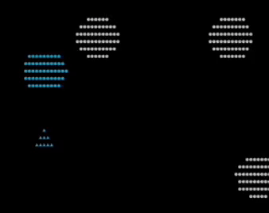

# Go-Go-Go

A full-stack multiplayer [Alkkagi (Stone-Shooting)](https://en.wikipedia.org/wiki/Alkkagi) game built entirely in Go, featuring a `terminal user interface (TUI)`, `real-time WebSocket communication` and `game logic with physics`.

## Table of Contents
- [Project Overview](#project-overview)
- [How to Play](#how-to-play)
- [Core Components](#core-components)

## Project Overview
### 🖥️ **Terminal User Interface (TUI)**
- **Modern TUI**: Built with [Bubble Tea](https://github.com/charmbracelet/bubbletea) framework for a gui-like experience in the terminal.
- **Real-time Rendering**: Render game state and animations by using handling custom animation logic.

### 🌐 **Real-time Multiplayer**
- **WebSocket Communication**: Instant game state synchronization by sending game events and animation by using [Gorilla WebSocket](https://github.com/gorilla/websocket).
- **Live Message System**: In-game messaging for player interaction. Messages include chat and game events.

### 🎮 **Game Mechanics**
- **Physics Engine**: Realistic stone collision and movement simulation with calculations for velocity and acceleration.
- **Relative Positioning**: Stones are positioned in game board (100x100) with relative coordinates and rendered in user's current terminal window size.

### 💾 **Recording History**
- **Game Records**: Automatic recording of all game sessions with saving the event history. ([postgreSQL](https://www.postgresql.org))

## How to Play
1. **Start**: Select the start menu to match with another player. Use arrow keys or `H`, `J`, `K`, `L` keys to navigate. (see below for help)

2. **Match**: Wait for another player to join your session. when both players are ready, the game starts automatically.

3. **Game**: Use arrow keys or `H`, `J`, `K`, `L` keys to navigate and **control** your shoot. Press `I` to **chat** with other player. You can **resize** the window to see the game board and stones in more detail.

4. **Win**: If one player has no more stones left, the game ends and exit with an announcement of the winner.

### Previews

#### ***Shoot***

#### ***Chat*** 

#### ***Resize***

## Core Components

>We built this project from scratch to explore the basics of Go and demonstrate its use in a real-world application. Below are the main components of the project:

- **Logging**: Using [Slog](https://pkg.go.dev/log/slog), a structured logger for Go, to debug the application, track game flow, and resolve issues.
- **Testing**: Go’s testing environment enabled us to write testable code and address complex challenges (e.g., physics and UI rendering). We used [Require](https://pkg.go.dev/github.com/stretchr/testify/require) for assertions.
- **Websocket**: Using [Gorilla WebSocket](https://github.com/gorilla/websocket) for real-time communication. We leveraged goroutines for concurrent connections and channels for message passing, following the library’s documentation and examples.
- **TUI**: Using [Bubble Tea](https://github.com/charmbracelet/bubbletea) for a modern TUI framework, styled with [Lipgloss](https://github.com/charmbracelet/lipgloss) and enhanced with [Bubbles](https://github.com/charmbracelet/bubbles) for UI components. We implemented custom UI layout components (e.g., Column, Row, FlexContainer) similar with Flutter widgets. Also, the TUI structure was inspired by [opencode](https://github.com/opencode-ai/opencode) project.
- **Responsive UI**: The game board is rendered using relative coordinates, adapting to the user’s current terminal window size. Run the application and resize your terminal to see the UI adjust dynamically!
- **Physics Simulation**: A custom 2D physics engine for realistic stone movement and collision detection, built entirely in Go without external libraries. (That’s why we named this project “Go-Go-Go”!)

### Future Plans
- Single-player mode with AI opponent
- User customization options (e.g., stone colors, board size)
- Special stone types (e.g., stones with special abilities)
- User Accounts and Authentication

### Contributors
- [@yanmoyy](https://github.com/yanmoyy)
- [@Gutssssssssss](https://github.com/Gutsssssssssss)

### License
[MIT](./LICENSE)
